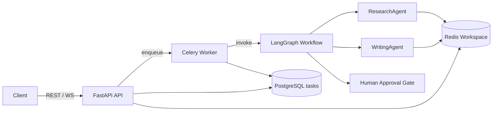

# Collaborative AI Agent Orchestration Framework with LangGraph

Production-style multi-agent backend that orchestrates specialized AI agents through a **LangGraph** state machine, with **FastAPI** for HTTP/WebSocket APIs, **Celery** for async execution, **PostgreSQL** for durable task state, and **Redis** for Celery brokering plus per-task agent scratchpads.

## Architecture



| Component | Role |
|-----------|------|
| **FastAPI (`api`)** | `POST /api/v1/tasks`, `GET /api/v1/tasks/{id}`, `POST .../approve`, `GET /health`, WebSocket `/ws/tasks/{id}` |
| **Celery (`worker`)** | Runs the LangGraph workflow in the background |
| **PostgreSQL (`db`)** | `tasks` table: status, result, `agent_logs` (JSONB audit trail) |
| **Redis (`redis`)** | DB 0: workspace `task:{id}:workspace`; DB 1/2: Celery broker & results; pub/sub for WebSocket status |

### LangGraph workflow

1. **Research** — `ResearchAgent` calls a mock `web_search` tool for LangGraph and CrewAI features; findings are stored in Redis `task:{task_id}:workspace`.
2. **Writing** — `WritingAgent` reads the workspace and drafts a comparison; status becomes `AWAITING_APPROVAL`.
3. **Await approval** — graph polls PostgreSQL until the human calls the approve API (`RESUMED`).
4. **Finalize** — persists the final summary and sets status `COMPLETED`.

### Resilience (flaky tool)

Submit prompt `__FLAKY_TEST__`. The research tool issues query `__FLAKY_TEST__`, fails once (`status: tool_error` in `logs/agent_activity.log`), retries, then completes.

## Prerequisites

- Docker & Docker Compose
- Optional: `curl`, `wscat`, `redis-cli`

## Quick start

1. Copy environment template:

   ```bash
   cp .env.example .env
   ```

2. Start all services:

   ```bash
   docker compose up --build -d
   ```

3. Wait until services are healthy (under ~3 minutes):

   ```bash
   docker compose ps
   curl http://localhost:${API_PORT:-8001}/health
   ```

   The API container listens on port **8000** internally; the host port defaults to **8001** if `8000` is busy (`API_PORT` in `.env`).

## API usage

On **Windows PowerShell**, use `Invoke-RestMethod` (or `curl.exe` for real curl — note the `.exe` suffix). Examples below use port `8001` (default host mapping).

### Create task (202 Accepted)

**PowerShell:**

```powershell
$body = @{
  prompt = "Research the key features of LangGraph and CrewAI. Write a short comparison summary for a technical audience."
} | ConvertTo-Json

Invoke-RestMethod -Uri "http://localhost:8001/api/v1/tasks" -Method Post -Body $body -ContentType "application/json"
```

**`curl.exe` in PowerShell** — PowerShell rewrites `-d` arguments unless you use the stop-parsing token `--%`:

```powershell
curl.exe --% -sS -X POST http://localhost:8001/api/v1/tasks -H "Content-Type: application/json" -d "{\"prompt\":\"Research the key features of LangGraph and CrewAI. Write a short comparison summary for a technical audience.\"}"
```

Without `--%`, use `Invoke-RestMethod` instead (recommended on Windows).

**Bash / Git Bash / WSL:**

```bash
curl -sS -X POST "http://localhost:8001/api/v1/tasks" \
  -H "Content-Type: application/json" \
  -d '{"prompt":"Research the key features of LangGraph and CrewAI. Write a short comparison summary for a technical audience."}'
```

### Poll status

**PowerShell:**

```powershell
Invoke-RestMethod -Uri "http://localhost:8001/api/v1/tasks/<task_id>"
```

### Approve (human-in-the-loop)

**PowerShell:**

```powershell
$approve = @{ approved = $true; feedback = "Looks good to proceed." } | ConvertTo-Json
Invoke-RestMethod -Uri "http://localhost:8001/api/v1/tasks/<task_id>/approve" -Method Post -Body $approve -ContentType "application/json"
```

### WebSocket updates

**Python (recommended on Windows)** — start the listener **before** creating a new task:

```powershell
pip install websockets
python scripts/ws_listen.py <task_id>
```

In a **second terminal**, create a task (`Invoke-RestMethod` or `curl.exe --%` above), then approve when prompted.

**Optional: install `wscat` via Node.js:**

```powershell
npm install -g wscat
wscat -c "ws://localhost:8001/ws/tasks/<task_id>"
```

Expect JSON messages: `{"task_id":"...","status":"RUNNING"}`, then `AWAITING_APPROVAL`, `RESUMED`, `COMPLETED`.

> **Note:** If the task already finished, the WebSocket will connect but you may not see past status events. Create a **new** task while the listener is running.

## Project layout

```
├── docker-compose.yml
├── Dockerfile / Dockerfile.api / Dockerfile.worker
├── .env.example
├── requirements.txt
├── src/
│   ├── main.py           # FastAPI app + WebSocket
│   ├── api.py            # REST endpoints
│   ├── workflow_graph.py # LangGraph orchestration
│   ├── agents.py         # ResearchAgent & WritingAgent
│   ├── tools.py          # web_search (+ flaky behavior)
│   ├── worker_tasks.py   # Celery entrypoint
│   ├── db.py             # PostgreSQL schema bootstrap
│   └── logging_setup.py  # JSON agent activity logs
├── logs/agent_activity.log
├── tests/
└── scripts/run_integration_test.py
```

## Verification

**Integration test** (stack must be running):

```bash
python scripts/run_integration_test.py
```

**Unit tests**:

```bash
pip install -r requirements.txt
pytest tests/ -q
```

**Redis workspace**:

```bash
docker compose exec redis redis-cli HGETALL "task:<task_id>:workspace"
```

**Agent activity log**:

```bash
tail -f logs/agent_activity.log
```

## Environment variables

See [.env.example](.env.example): `LLM_API_KEY`, `API_PORT`, `DATABASE_URL`, `REDIS_URL`, `CELERY_BROKER_URL`, `CELERY_RESULT_BACKEND`.

The demo uses deterministic mock tools; an API key is reserved for optional LLM provider integration.

## CI

GitHub Actions (`.github/workflows/integration.yml`) runs `docker compose up --build` and the integration test on push/PR.

## Submission checklist

- [x] `docker-compose.yml` with `db`, `redis`, `api`, `worker` and health checks
- [x] `.env.example`, `Dockerfile`, `README.md`, `src/`, `tests/`, `logs/agent_activity.log`
- [x] LangGraph multi-agent workflow with human approval
- [x] Redis workspace, structured logging, flaky-tool retry
